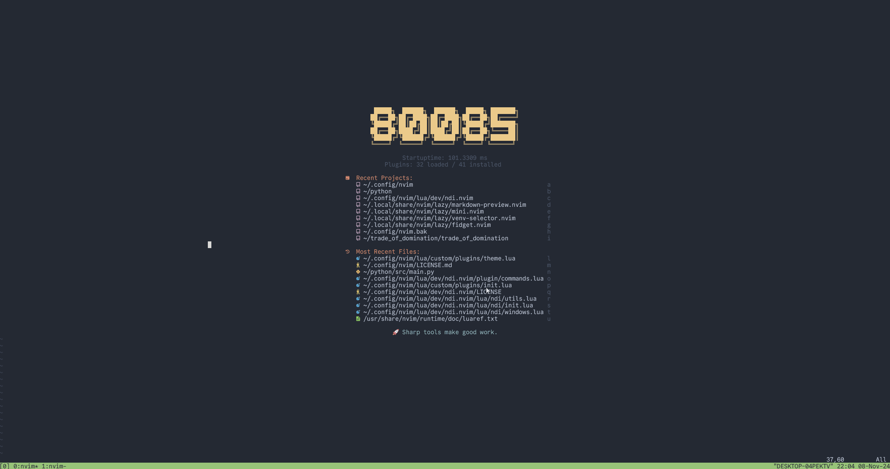

# Neovim Diagnostical Interface
A diagnostic utility for troubleshooting Neovim Configurations. This plugin uses the output of a command, extracts necessary information, and then prints it in a temporary buffer. 



There are currently two commands:  
1. GetLSPClientInfo - Gets configuration information on a currently-running Language Server Client.
1. GetPluginInfo - Gets the "package.loaded" table information for a specific package.

---

### Installation
##### Lazy.nvim
```lua
{
  'kyallanum/ndi.nvim',
  dependencies = {
    'junegunn/fzf',
  },
}
```

**NOTE:** Please feel free to add a PR for installation for other package managers.

---
### Configuration

Configuration allows you to create your own windows. There are two major requirements to get full functionality:
1. The command that produces the output must be in the form of a table (List or map, doesn't matter)
    1. If the command requires a variable, replace the variable with ``\\?``.
    1. Any variable meant to replace ``\\?`` should be put in a string[] variable and will be injected into the string at runtime.
1. You must provide a command that can be run by "fzf" with a specific key as a source to choose from.
    1. If the output of this command is a list of tables, provide the key in each table that needs to be extracted.


Example:
```lua
{
    "kyallanum/ndi.nvim",
    dependencies = {
        'junegunn/fzf',
    },
    opts = {
        {
            name = 'LSP Information',
            command_name = 'GetLSPClientInformation',
            command = 'vim.lsp.get_clients {}',
            fzf_key = 'name',
            ident_keys = { 'id', 'name', 'config' },
            print_all_output = false,
        },
    },
    config = function(_, opts)
        require('ndi').setup(opts)
    end,
}
```
